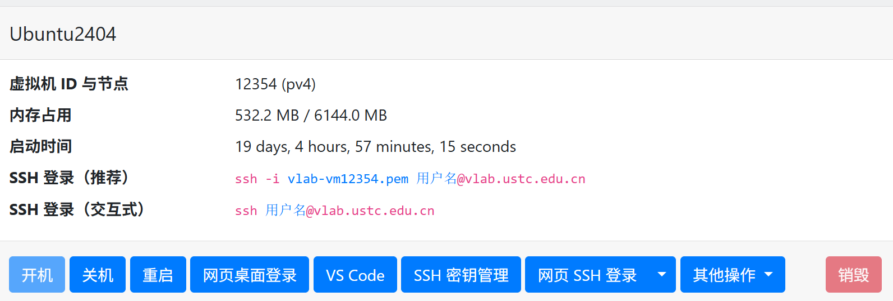

## Windows Subsystem for Linux (WSL 2) 指南

WSL 2 允许你在 Windows 上运行原生的 Linux 二进制可执行文件。对于不想折腾双系统或虚拟机的同学，这是**最推荐**的本地开发环境。

### 1. 一键安装
在 Windows 10 (版本 2004 及更高，内部版本 19041 及更高) 或 Windows 11 中，以**管理员身份**打开 PowerShell 或 Windows Terminal，输入：

```powershell
# 如果之前未安装过 WSL，此命令将启用所需功能并安装 Ubuntu
wsl --install

# 如果想列出可用的分发版
wsl --list --online

# 如果想安装特定的分发版（如 Ubuntu 24.04）
wsl --install -d Ubuntu-24.04
```

默认会安装 **Ubuntu**。安装完成后，你需要重启电脑并设置 Linux 用户名和密码（**注意：输入密码时屏幕不会显示字符**）。

更多详情请参考微软官方文档：[安装 WSL](https://learn.microsoft.com/zh-cn/windows/wsl/install)

### 2. 注意事项与常用命令
- **版本检查**：在 PowerShell 中运行 `wsl -l -v` 确保版本显示为 `2`。若是 `1`，请使用 `wsl --set-version <distro> 2` 升级。
- **文件互访**：
  - 在 Windows 访问 Linux 文件：在资源管理器地址栏输入 `\\wsl$`。
  - 在 Linux 访问 Windows 文件：路径通常在 `/mnt/c/Users/...`。
- **性能优化**：WSL 2 使用真正的 Linux 内核。建议将代码放在 Linux 文件系统（如 `~/projects`）中，**不要**在 `/mnt/c/` 下进行重型编译任务（如内核编译），这会导致速度极慢。
- **关机**：如果 WSL 占用内存过多，可以手动强制关闭：`wsl --shutdown`。

### 3. 配合 VS Code (推荐方案)

在 Windows 侧安装 VS Code，并搜索安装插件：**WSL**。
之后在 WSL 终端输入 `code .`，即可开启丝滑的开发体验。


如果你发现 `wsl --install` 报错，请检查 BIOS 中是否开启了 **虚拟化技术 (Virtualization)**。



---


## VLab 云实验平台使用指南

科大 [VLab (vlab.ustc.edu.cn)](https://vlab.ustc.edu.cn/vm/) 为每位同学提供了强大的云端虚拟机，环境统一且不占用本地资源。

### 1. 创建环境
1. 登录平台后，选择 **Ubuntu 24.04** 或 **Ubuntu 22.04** 镜像创建虚拟机，并输入一个虚拟机名称。
2. 创建好虚拟机后，稍等 3 分钟，然后将虚拟机开机。

3. 下面列出了多种使用方式，可根据个人喜好选择。
 
### 2. 远程连接与访问规则
由于安全策略，VLab 的 IP 通常只能在校内访问。
- **校外访问**：请务必先连接 [校内 VPN (SSLVPN)](https://vpn.ustc.edu.cn)。
- **网页终端**：虽然网页自带 网页桌面，但由于延迟和粘贴不便，**强烈建议使用 SSH 连接**。


 VLab 磁盘空间有限，默认只有 20GB-40GB，请不要在里面存储大量的无关视频或大数据集。


完整的使用指南请参考官方文档：[VLab 使用手册](https://vlab.ustc.edu.cn/docs/)

---

## SSH：连接你的开发世界

SSH (Secure Shell) 是系统程序员的“传送门”。学会它，你就可以在本地舒适的编辑器里操控任何一台远程服务器。

### 1. 基础连接
打开你电脑的终端（CMD/PowerShell/Terminal），输入：
```bash
# 格式：ssh 用户名@IP地址
ssh username@202.38.xxx.xxx

```

### 2. VS Code Remote SSH

这是目前最高效的开发流程：

1. 安装插件 **Remote - SSH**。
2. 点击左下角蓝色图标 `><` -> `Connect to Host...`。
3. 输入 `username@ip`。
4. **效果**：你可以像编辑本地文件一样使用 VS Code 所有的功能（语法高亮、自动补全、插件），但代码实际上运行在远程服务器（VLab/WSL）上。

### 3. 告别密码：免密登录

每次输入密码很痛苦？

1. **本地生成密钥对**：`ssh-keygen -t ed25519` (一路回车)。
2. **拷贝给服务器**：`ssh-copy-id username@ip`。
之后，连接时将不再询问密码。

### 4. 极致配置：`.ssh/config`

你不需要记住复杂的 IP！编辑你的 `~/.ssh/config` (Windows 在 `C:\Users\YourName\.ssh\config`)：

```ssh
Host my-lab
    HostName 202.38.xxx.xxx
    User root
    Port 22
    IdentityFile ~/.ssh/id_ed25519 # 可选
```

**用法**：以后只需输入 `ssh my-lab` 即可连接。

### 5. 常见问题排查 (Troubleshooting)

- **SSH 免密失败**：确认本地 `.ssh/authorized_keys` 权限为 600（虽然 WSL/VLab 对此宽松，但 SSH 协仪本身很敏感）。
- **Connection Timed Out**：通常是网络问题。如果是 VLab，请检查 **VPN** 是否连接。
- **VS Code "Setting up SSH Host" 卡死**：通常是远程端在初始化下载 VS Code Server。请耐心等待，或者检查网络连接。

---


## 服务器永不掉线：Tmux 简要教程

当我们断开 SSH 时，运行在服务器上的程序往往会随之关闭。**Tmux (Terminal Multiplexer)** 可以让程序在一个虚拟窗口中持续运行，直到你手动关闭。

### 1. 核心操作
- **安装**：`sudo apt install tmux` (Ubuntu 默认大部分已带)。
- **新建窗口**：`tmux`。
- **离开窗口 (Detach)**：按 `Ctrl + B` 后，再按 `D`。此时你的代码在后台运行！
- **重新进入 (Attach)**：`tmux attach`。


在实验过程中（尤其是耗时较长的程序运行），**极其强烈建议**开启一个 `tmux` 窗口。这能有效防止因无线网络波动产生的 SSH 断连导致实验数据丢失。


