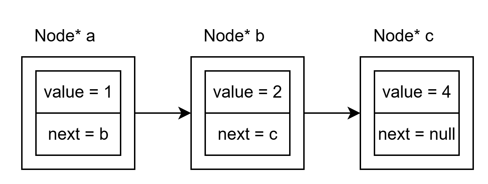
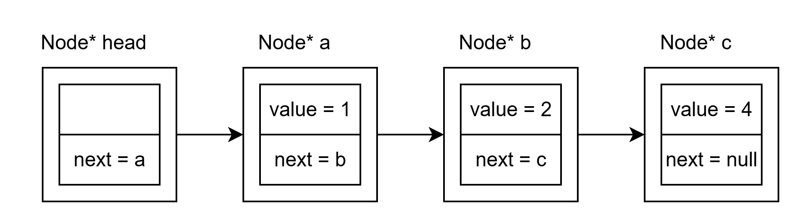
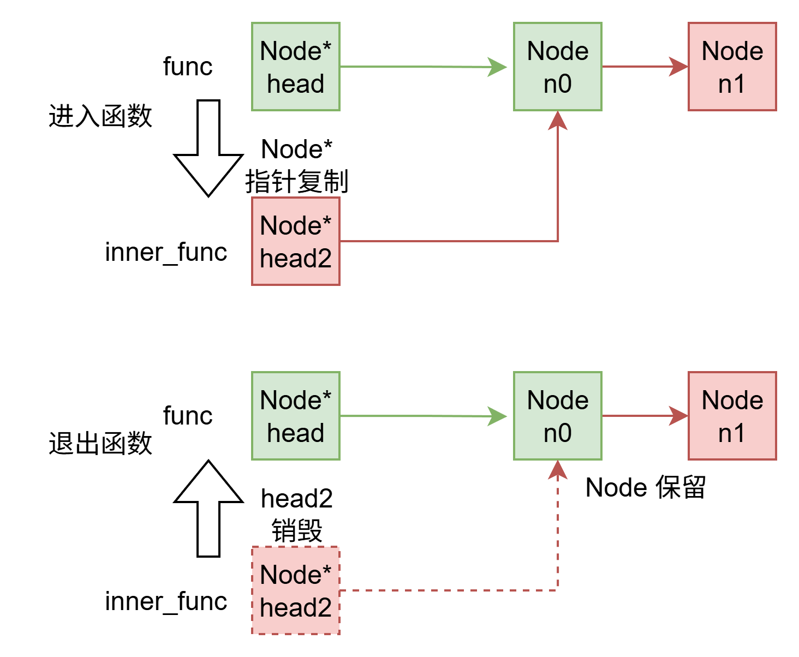

链表是一种用于存储数据的数据结构，通过如链条一般的指针来连接元素．它的特点是插入与删除数据十分方便，但寻找与读取数据的表现欠佳．

链表和数组都可用于存储数据．与链表不同，数组将所有元素按次序依次存储．不同的存储结构令它们有了不同的优势：

- **链表**：因其链状的结构，可以用少量操作方便地删除、插入数据．但也因为这样，访问链表第 `k` 个元素需要对其前 `k` 个节点都进行一次内存访问，效率不如数组高．
- **数组**：可以方便地寻找并读取数据，可以使用一次内存访问定位到数组的任意一个元素．但删除、插入时则不得不移动相邻的所有元素．

## 1. 构建链表

### 1.1 单向链表

单向链表中包含数据域和指针域，其中数据域用于存放数据（例如下面中的`value`），指针域用来连接 当前结点 与 下一节点．

```c
struct Node {
  int value; 
  struct Node *next;
};
```


上面的链表有三个节点，分别存储数据 1, 2, 4。为了方便起见，链表一般包含一个不含任何数据的节点 head:



head 节点不存储任何数据（或者你可以在里面存储链表长度）。

你可以像数组一样在函数间传递链表，对链表的任何更改都不会在退出函数时消失，下面函数中 insert_node 插入的节点显然不会因为退出 insert_node 函数消失。

```C
void insert_node(struct Node* head2)
{
	struct Node* node = make_node();
	head2->next = node;
}
void func()
{
	struct Node* head = make_node();
	insert_node(head, 1);
}
```





### 1.2 双向链表

双向链表中同样有数据域和指针域．不同之处在于，有两个指针，分别连接前后节点。

```c
struct Node {
  int value;
  struct Node *pre;
  struct Node *next;
};
```


双向链表也建议准备一个头节点。

## 2. 向链表中插入（写入）数据

### 2.1 单向链表

如果你想将元素插入到链表的某个位置，你需要

1. 创建一个新的节点 `node`，填入你想要的元素
2. 找到你要插入的位置，比如你想把 `node` 插到节点 `a` 后面

```c
void insertNode(struct Node *a, struct Node* node) {
	// 寻找当前 a 后面的节点 （是空的也没关系）
	struct Node* b = a->next;
	// 更新 a 的指针
	a->next = node;
	// 更新 node 的指针
	node->next = b;
}
```

取决于你希望插入的位置，`a` 可能不同。比如你有链表 `Node* head`（指向头节点），一般有头插法和尾插法两种方法


**头插法**将元素添加到链表开头，也就是让新节点成为头节点后第一个节点

```c
void insertNode(struct Node *head, struct Node* node) {
	// a 就是 head
  struct Node *a = head;
	// 寻找当前 a 后面的节点
	struct Node* b = a->next;
	// 更新 a 的指针
	a->next = node;
	// 更新 node 的指针
	node->next = b;
}
```

**尾插法**将元素添加到链表末尾

```c
void insertNode(struct Node *head, struct Node* node) {
	// a 是最后一个元素，它的后面是空的
  	struct Node *a = head;
	while(a->next != NULL) a = a->next;
	// 寻找当前 a 后面的节点
	struct Node* b = a->next;
	// 更新 a 的指针
	a->next = node;
	// 更新 node 的指针
	node->next = b;
}
```

你会发现每次插入需要遍历整个链表，当然你能准备一个 tail 跟踪链表尾部（记得使用指针！）

```c
void insertNode(struct Node *head, struct Node* node, struct Node** tail) {
	// a 是最后一个元素 tail
  	struct Node *a = *tail
	// 寻找当前 a 后面的节点
	struct Node* b = a->next;
	// 更新 a 的指针
	a->next = node;
	// 更新 node 的指针
	node->next = b;
	// tail 被更新了，tail 现在是 node
	*tail = node;
}
```

通过恰当的插入方式，可以维护一个有序链表，比如升序链表，后面的节点比前面的大。

```c
void insertNode(struct Node *head, struct Node* node) {
	// a 是表最后一个比 node 小的 （或者是 head）
	struct Node *a = head;
	while(a->next != NULL
		&& a->next->val < node->val) a = a->next;
	// 寻找当前 a 后面的节点
	struct Node* b = a->next;
	// 更新 a 的指针
	a->next = node;
	// 更新 node 的指针
	node->next = b;
	// tail 被更新了，tail 现在是 node
	*tail = node;
}
```

### 2.2 单向循环链表

将链表的头尾连接起来，链表就变成了循环链表。空的循环链表 `head->next == head`

插入元素只需要把所有非循环链表中的 `NULL` 替换为 `head`，例如

```c
void insertNode(struct Node *head, struct Node* node) {
	// a 是表最后一个比 node 小的 （或者是 head）
	struct Node *a = head;
	while(a->next != head
		&& a->next->val < node->val) a = a->next;
	// 寻找当前 a 后面的节点
	struct Node* b = a->next;
	// 更新 a 的指针
	a->next = node;
	// 更新 node 的指针
	node->next = b;
	// tail 被更新了，tail 现在是 node
	*tail = node;
}
```

### 2.3 双向链表

双向链表需要维护 `pre` 指针。假设你需要将节点 `node` 插入到节点 `a` 后面

```c
void insertNode(struct Node *a, struct Node* node) {
	// 寻找当前 a 后面的节点
	struct Node* b = a->next;
	// 更新 a 的指针
	a->next = node;
	// 更新 node 的指针
	node->pre = a;
	node->next = b;
	// 更新 b 的指针（假如它不是空的）
	if(b != NULL) b->pre = node;
}
```

### 2.3 双向循环链表

双向循环链表假设 `head` 在 `tail` 后面（因此它是循环的），它的特点是：

1. 寻找某个节点的时候，遇到 `head` 代表碰到了链表末尾
2. 更新指针的时候，不必担心遇到 `NULL`


插入：

```c
void insertNode(struct Node *a, struct Node* node) {
	// 寻找当前 a 后面的节点
	struct Node* b = a->next;
	// 更新 a 的指针
	a->next = node;
	// 更新 node 的指针
	node->pre = a;
	node->next = b;
	// 更新 b 的指针（不可能是空的）
	b->pre = node;
}
```

寻找特定节点：

```c
void insertNode(struct Node *head, struct Node* node) {
	// a 是表最后一个比 node 小的 （或者是 head）
	struct Node *a = head;
	while(a->next != head
		&& a->next->val < node->val) a = a->next;
	// .......
}
```

特别的，寻找尾节点进行尾插法特别方便

```c
void insertNode(struct Node *head, struct Node* node) {
	// a 是最后一个元素，它在 head 前面
  	struct Node *a = head->pre;
	// .......
}
```


## 3. 从链表中删除数据

### 3.1 单向链表

假设你需要删除节点 `node`，你会发现由于你找不到它前面那个节点，你需要从头节点开始找

```c
void deleteNode(struct Node *head, struct Node* node) {
	// 寻找前一个节点
	struct Node* a = head;
	while(a->next != node) a = a->next;
	// 寻找 node 后面的节点
	struct Node* b = node->next;
	// 更新 a 的指针
	a->next = b;
	// 删除 node
	free(node);
}
```

### 3.2 单向循环链表


因为是循环的，你不需要 `head` 了，但是建议有 `head` 还是从 `head` 开始寻找，从 `node` 开始是最慢的。

```c
void deleteNode(struct Node* node) {
	// 寻找前一个节点
	struct Node* a = node;
	while(a->next != node) a = a->next;
	// 寻找 node 后面的节点
	struct Node* b = a->next;
	// 更新 a 的指针
	a->next = b;
	// 删除 node
	free(node);
}
```

### 3.3 双向链表

现在你可以很轻松寻找到前一个节点
```c
void deleteNode(struct Node* node) {
	// 寻找前一个节点
	struct Node* a = node->pre;
	// 寻找 node 后面的节点
	struct Node* b = node->next;
	// 更新 a 的指针
	a->next = b;
	// 更新 b 的指针（如果非空）
	if(b != NULL) b->pre = a;
	// 删除 node
	free(node);
}
```


### 3.4 双向循环链表

你不需要担心 `NULL` 了
```c
void deleteNode(struct Node* node) {
	// 寻找前一个节点
	struct Node* a = node->pre;
	// 寻找 node 后面的节点
	struct Node* b = node->next;
	// 更新 a 的指针
	a->next = b;
	// 更新 b 的指针（如果非空）
	b->pre = a;
	// 删除 node
	free(node);
}
```