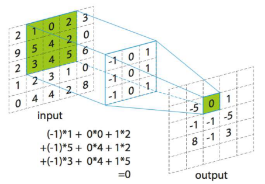

## 1. 实验背景
图像卷积是计算机视觉与人工智能中的基础计算。本实验要求你在保证结果正确的前提下，优化 C 语言卷积实现，理解缓存局部性、分支预测与循环开销对性能的影响。


### 1.1 卷积是什么？

从宏观来看，**卷积（Convolution）** 是一种通过周围邻域信息来改变当前像素值的运算。它通过一个小的矩阵（卷积核）对输入图像进行滑动窗口操作，生成一个新的输出图像。

#### 核心组成：
1.  **输入图像**：灰度图像是一个 $N \times N$ 的数字矩阵（像素值 0-255，本实验中为 `float`）。
2.  **卷积核/算子 (Kernel/Filter)**：一个小的数字矩阵（通常是 $3 \times 3$ 或 $5 \times 5$），它定义了如何“改变”像素。
3.  **输出图像**：卷积运算后的结果。

---

### 1.2 卷积怎么算？

计算过程遵循 **“相乘并累加”** 的原则。

#### 步骤详解：
假设你有一个 $3 \times 3$ 的卷积核，要计算坐标为 $(i, j)$ 的输出像素：

1.  **放置**：将卷积核的**中心点**对准输入图像的 $(i, j)$ 像素。
2.  **点乘**：将卷积核覆盖到的所有像素点，与卷积核对应位置的权重逐一相乘。
3.  **累加**：将这 9 个乘积相加，得到的结果就是输出图像在 $(i, j)$ 处的值。
4.  **滑动**：向右或下移动一个单位，重复上述过程，直到覆盖全图。



#### 边界处理：Zero Padding
当卷积核对齐到图像边缘时，一部分核会落在图像外面。本实验使用 **Zero Padding**：假设图像边界以外的所有值都是 **0**。这保证了输出图像的尺寸与输入图像完全一致。

当然，实际应用中还有其他边界处理方法，但本实验只要求实现 Zero Padding。


## 2. 实验任务
你需要实现并优化函数：

```c
void convolution(int n, float *src, float *kernel, float *dst);
```

其中：
- `src`：输入灰度图，尺寸 `n x n`，按行连续存储。
- `kernel`：卷积核，固定为 `5 x 5`，按行连续存储。
- `dst`：输出图像，尺寸 `n x n`。

### 2.1 Zero Padding 规则
卷积访问到图像边界外时，像素值按 `0` 处理。

## 3. 编程限制
- 语言：标准 C。
- 正确性：与 `baseline_convolution` 一致（允许微小浮点误差）。

## 4. 性能评价
加速比定义为：

$$
Speedup_{total} = \left( \prod_{i=1}^{m} \frac{TPE_{baseline, i}}{TPE_{optimized, i}} \right)^{\frac{1}{m}}
$$

其中 **TPE (Time Per Element)** 为处理单个像素的平均纳秒数 ($TPE = \frac{T}{N^2}$)。通过对比不同尺度下的 TPE，你可以观察到性能的变化。

性能基于 $N \in \{512, 1024, 2048, 4096, 8192\}$ 五个尺度下的几何平均加速比。


## 5. 代码结构
- `main.c`：评测驱动（正确性 + 性能）
- `convolution.c`：你主要修改的文件
- `convolution.h`：接口定义

## 6. 运行方式

编译并测试（每个测试只跑一轮）：

```bash
make test
```

性能评测（每个测试跑5轮）：

```bash
make perf
```

自定义输入：

```bash
./lab5 [rounds] [seed]
```

## 8. 提交建议
- 提交代码与报告
- 报告中需包含：优化思路、关键代码、性能对比等
